# Day 2: In-Car Voice Assistant System Architecture

This diagram shows the planned end-to-end flow of the in-car voice assistant system.

```mermaid
flowchart LR
    U[User] --> UI[Streamlit UI]

    UI --> API[FastAPI Backend<br/>/transcribe � /intent � /ask]

    API --> A[Audio Input<br/>WAV file / Microphone]

    A --> P[Preprocessing<br/>librosa<br/>normalize � resample � clean audio]

    P --> ASR[ASR Layer<br/>Whisper-tiny<br/>speech to text]

    ASR --> T[Transcript Text<br/>cleaned user command]

    T --> IC[Intent Classifier<br/>DeBERTa-V3 + LoRA<br/>navigation � music � climate � weather]

    IC --> IO[Intent Output<br/>predicted user intent]

    IO --> RAG[RAG Pipeline<br/>LangChain + FAISS<br/>retrieve relevant context]

    KB[(Knowledge Base<br/>car manual � FAQs � vehicle context)]

    KB --> RAG

    RAG --> RG[Response Generator<br/>create final answer]

    RG --> FR[Final Response<br/>text answer to user]

    FR --> UI

    DB[(PostgreSQL<br/>metadata � transcripts � intents � feedback � logs)]

    A -.metadata.-> DB
    ASR -.transcripts.-> DB
    IC -.intents.-> DB
    FR -.feedback.-> DB

    MON[Monitoring Dashboard<br/>Streamlit + Plotly<br/>latency � errors � feedback � metrics]

    DB -.metrics.-> MON

    style A fill:#e1f5ff,stroke:#0288d1
    style P fill:#ede7f6,stroke:#7e57c2
    style ASR fill:#ede7f6,stroke:#7e57c2
    style IC fill:#ede7f6,stroke:#7e57c2
    style RAG fill:#e3f2fd,stroke:#1976d2
    style KB fill:#fff8e1,stroke:#f9a825
    style RG fill:#e8f5e9,stroke:#43a047
    style FR fill:#e8f5e9,stroke:#43a047
    style DB fill:#fff3e0,stroke:#fb8c00
    style MON fill:#fce4ec,stroke:#d81b60
```

## Architecture Summary

The system starts with a user speaking a command through the Streamlit UI. FastAPI receives the request and sends the audio through preprocessing, ASR, intent classification, and RAG.